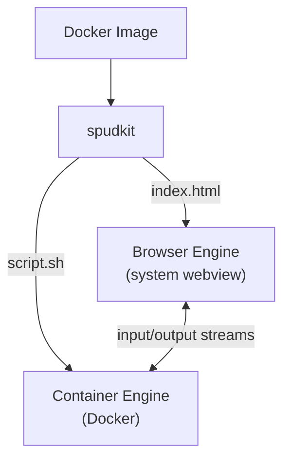

# SpudKit

A platform for building tiny minimalistic desktop apps that can be easily
distributed as OCI/Docker images. (For now Linux only)

SpudKit fully takes care of the distribution of desktop apps and removes the need
to set up a build system such as Tauri or Electron. Also removes the need to bundle
a browser engine with your app.

SpudKit apps run fully containerized: their "backends" is a small "serverless" CLI apps,
running inside a Docker or Podman container. The frontend runs inside your operating
systems built-in browser engine.

Since SpudKit app's backends are just CLI apps, SpudKit apps can still be used in
Unix pipelines.

Think: shell scripting, but with a desktop GUI and easier to share with others!


## How It Works

A SpudKit app is a Docker image built on the **spudkit base image** (`images/base/`) containing:

1. **A fully static web frontend** (HTML/JS/CSS)
2. **"Backend" scripts or binaries** that run inside the container

SpudKit will only load images derived from the base image.

SpudKit takes care of wiring the backend and frontend together and running your app:
the frontend can communicate with the backend using a streaming API - effectively,
stdin, stdout and stderr.




## The Streaming API

`POST /_api/calls` creates a call and returns an SSE stream. The first event is `started` with a `call_id` that can be used to send stdin:

| Endpoint | Method | Description |
|---|---|---|
| `/_api/calls` | POST | Create a call and stream output. Body: `{"cmd": ["/script.sh"]}`. Returns SSE stream. |
| `/_api/calls/{id}/stdin` | POST | Send input to a running process. Body: `{"data": {...}}`. |

The server also exposes a management API on `/tmp/spudkit.sock`:

| Endpoint | Method | Description |
|---|---|---|
| `/activate` | POST | Activate an app. Body: `{"name": "app-name"}`. Starts container. |
| `/apps` | GET | List active apps. |
| `/spuds` | GET | List all available spuds (installed images). |

### Event types

Backend processes can control event types by writing tagged JSON to stdout:

```sh
# Auto-tagged as {"event": "output", "data": "hello"}
echo "hello"

# Custom event type — passed through as-is
echo '{"event": "progress", "data": {"percent": 50}}'
```

Stderr output is automatically tagged as `{"event": "error", ...}`. When the process exits, an `{"event": "end"}` is sent.

## Frontend Options

SpudKit app frontends are just static web files. You can use any frontend technology:

- **HTMX + shell scripts** — no JavaScript, no build step. Great for simple tools.
- **React / Vue / Svelte** — use Vite or any bundler. The build output goes in `/app/gui/`.
- **Vanilla JS** — just HTML, CSS, and `<script>` tags.

For JS-based frontends, use the streaming `/_api/calls` API to get real-time output from
your backend scripts (word-by-word, line-by-line). For HTMX, use the `/_api/render` endpoint
which collects all output and returns rendered HTML — simpler, but not streaming.

## HTMX Support

SpudKit has built-in support for [HTMX](https://htmx.org/), making it possible to write web apps without having to write JavaScript.

> **Note:** The `/_api/render` endpoint waits for the script to finish before returning HTML.
> For real-time streaming (e.g., chat, progress updates), use the `/_api/calls` API with
> JavaScript instead.

### How it works

The `/_api/render/{script}` endpoint runs a script, collects its output, renders it
through a [Jinja2 template](https://jinja.palletsprojects.com/), and returns HTML.

The template rendering system is a convenience feature added to make it convenient to use HTMX.

Form fields are automatically converted to JSON and sent as stdin to the script.

### Quick example: Search in Alice's Adventures in Wonderland

A full-text search app for Alice's Adventures in Wonderland in 3 simple files

**`app/bin/search.sh`** — the backend (uses `grep` and `jq`):

```sh
#!/bin/sh
query=$(jq -r '.query')

if [ -z "$query" ]; then
    echo "Please enter a search term"
    exit 0
fi

grep -i -n "$query" /book.txt
```

**`app/templates/search.html`** - the template (Jinja2 syntax):

```html

  <pre>
    <code>{{ line }}</code>
  </pre>



  <p>
    <em>No results found.</em>
  </p>

```

**`app/gui/index.html`** - the frontend (HTMX + Pico CSS):

```html
<!DOCTYPE html>
<html data-theme="dark">
<head>
    <link rel="stylesheet" href="/pico.min.css">
    <script src="/htmx.min.js"></script>
</head>
<body>
    <main class="container">
        <h1>Book Search</h1>
        <form hx-post="/_api/render/search.sh" hx-target="#results">
            <fieldset role="group">
                <input type="text" name="query" placeholder="Search..." autofocus />
                <button type="submit">Search</button>
            </fieldset>
        </form>
        <section id="results"></section>
    </main>
</body>
</html>
```

**`Dockerfile`**:

```dockerfile
FROM spudkit-base
RUN apt-get update && apt-get install -y curl jq && rm -rf /var/lib/apt/lists/*
RUN curl -sL "https://cdn.jsdelivr.net/npm/@picocss/pico@2/css/pico.min.css" -o /app/gui/pico.min.css
RUN curl -sL "https://unpkg.com/htmx.org@2.0.4/dist/htmx.min.js" -o /app/gui/htmx.min.js

# Download the book
RUN curl -sL "https://www.gutenberg.org/cache/epub/11/pg11.txt" -o /book.txt

COPY app/ /app/
RUN chmod +x /app/bin/search.sh
```

Build and run:

```sh
docker build -t book-search .
spud-app book-search
```

You can still use the app from the CLI:

```sh
echo '{"query": "rabbit"}' | spud run book-search search.sh
```

## CLI Composability

SpudKit apps work like Unix tools:

```sh
# Pipe between apps
spud run data-loader /export.sh | spud run visualizer /plot.sh

# List available spuds
spud ls
```

## Shared App Data

Spuds can access host application data directories. This lets a spud share data with
CLI tools or other apps that use the same XDG data directory.

To declare which data directories a spud needs, add a label to the Dockerfile:

```dockerfile
LABEL io.github.kantord.spudkit.shared_app_data="myapp"
```

When the spud is activated, spudkit mounts `~/.local/share/myapp/` from the host
into the container at the same path. The app inside the container can access the
data at its standard location without needing to know it's containerized.

Multiple directories are comma-separated:

```dockerfile
LABEL io.github.kantord.spudkit.shared_app_data="myapp,other-app"
```

## License

Licensed under either of [Apache License, Version 2.0](LICENSE-APACHE) or [MIT License](LICENSE-MIT) at your option.
